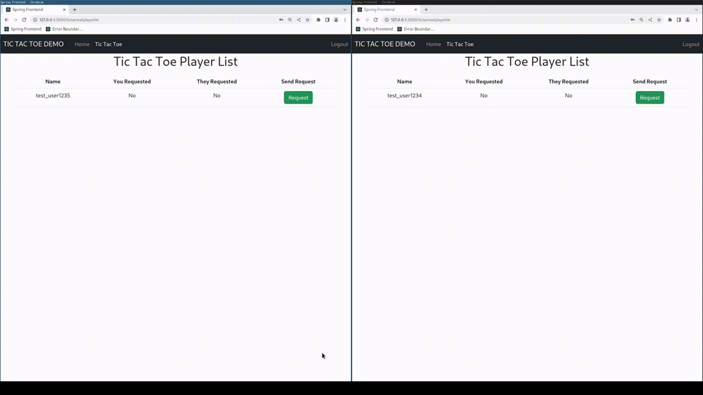
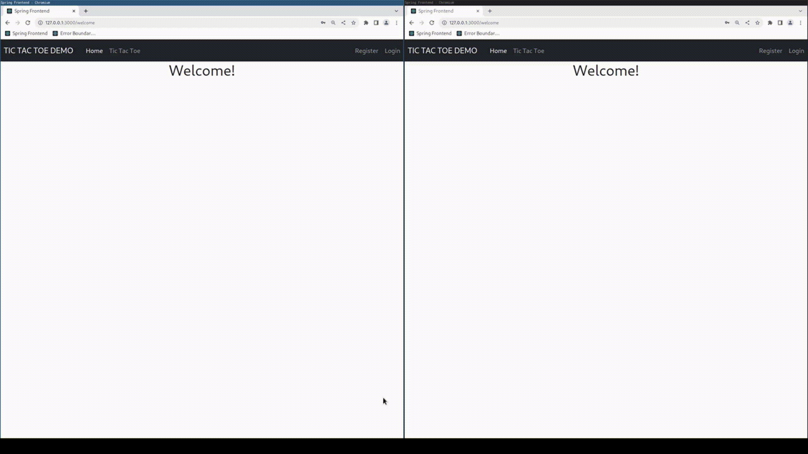
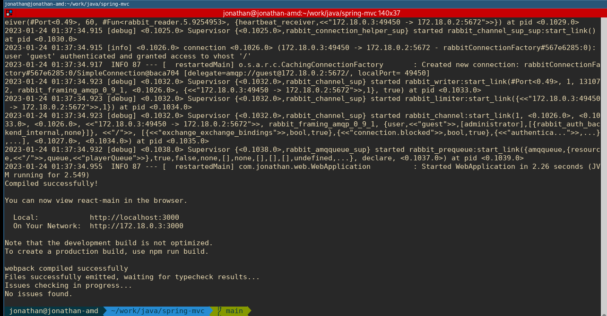
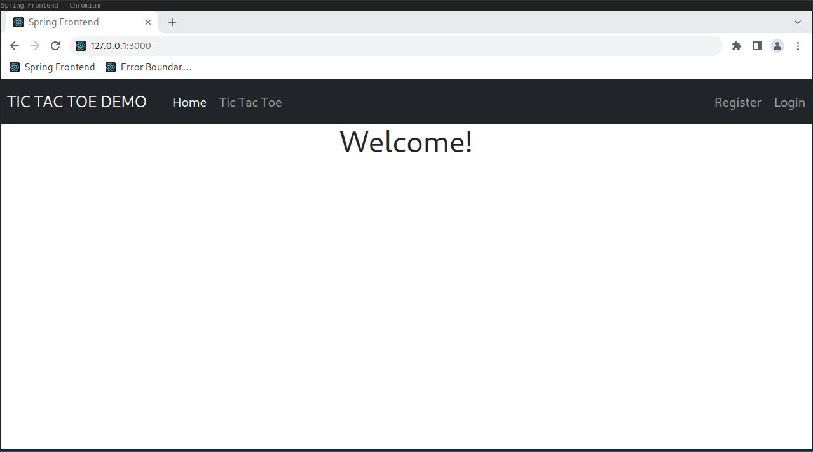

# Tic Tac Toe Web Application

---

  

## About The Project

---

<p>This application uses Docker containers running Spring Boot, ReactJS, RabbitMQ, and MariaDB to allow users to competitively play Tic Tac Toe games in real time.</p>
Technologies used include:  
* ReactJS frontend using Axios to interface with a Spring Boot backend REST API for user login and registration  
* STOMP JS WebSockets to allow realtime message handling from Spring Boot when playing Tic Tac Toe against other users  
* RabbitMQ message-broker to filter user messages and require users to log in before accepting a WebSockets connection  
* Spring AMQP to handle connections from the Java backend to RabbitMQ  
* Spring Filter chains to prevent unauthorized access by users without valid Java Web Tokens  
* MariaDB to store user login information and encrypted passwords which are accessed by Spring Boot using Hibernate  
<br>
<br>

## User Registration and Login

---

<p>Users must register and login if they want to use the online game mode but can play games on a single PC without authentication.</p>
<br>
  
<br>
<br>

## Installation and Running

---

<strong>This application was tested on an Arch Linux installation running [Docker](https://www.docker.com/) daemon version 20.10.22.</strong>

<p>The application runs in three docker containers which run on subnet 172.18.0.0/16.<br>
The launch-server script in the root project directory will automatically set up the required network bridge and build the containers</p>

```console
$ ./launch-server.sh
```
The terminal should return a result similar to the following after the Docker build and install script has finished
running  
<br>
  
<br>
<br>

## Connecting

---

The React.JS server uses a bridge to the host local network and can be accessed through the host web browser at [http://localhost:3000](http://localhost:3000) or [http://127.0.0.1:3000](http://127.0.0.1:3000).  
The React frontend will display the welcome page:  

  


